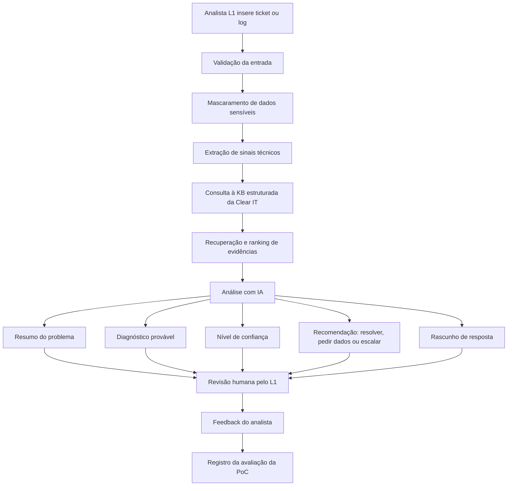

# Technical Context v1.2 — Projeto Copiloto Clear IT

> Fonte de verdade de Engenharia para a fase atual do projeto.  
> Persona responsável: `@engineer`  
> Fase Onion: Engineer Cycle — Plan  
> Status: Versão consolidada para validação da PoC e preparação de decisão PoC → MVP  
> Última atualização: 2026-07-02  
> Origem: consolidação de `technical-context-lite-v1.1-poc-clear-it.md` com os pontos fortes de `generated-technical-context-lite.md`.  
> Observação: este documento **não define código, stack final ou implementação produtiva**. Ele consolida a estratégia técnica de PoC controlada antes do MVP.

---

## 0. Resumo Executivo para Cliente

O projeto propõe um **Copiloto de IA para apoiar Analistas de Suporte L1 da Clear IT** na análise inicial de tickets, logs e sintomas técnicos.

A recomendação atual de Engenharia é **não avançar diretamente para um MVP produtivo**. O caminho mais seguro é executar primeiro uma **PoC consultiva e controlada**, usando a Knowledge Base já produzida e estruturada pela Clear IT.

A PoC deve validar se o Copiloto consegue:

- interpretar tickets e logs;
- consultar a KB estruturada da Clear IT;
- recuperar evidências úteis;
- indicar diagnóstico provável;
- informar nível de confiança;
- sugerir coleta de dados adicionais quando faltar informação;
- recomendar escalonamento quando o L1 não tiver informação suficiente para buscar e resolver o problema;
- gerar rascunho de resposta para revisão humana;
- registrar evidências, limitações e feedback do analista.

A IA deve atuar como **apoio consultivo**, e não como agente autônomo.  
A decisão final continua sendo do analista humano.

---

## 1. Evidências e Decisões Usadas neste Documento

### 1.1 Evidências já disponíveis

Com base nos documentos do projeto e nas decisões informadas:

- O produto é um Copiloto de IA voltado para Analistas de Suporte L1.
- O Copiloto deve apoiar análise de tickets/logs, diagnóstico, evidências, confiança, escalonamento e resposta.
- A Clear IT possui uma **Knowledge Base produzida e bem estruturada**.
- O uso de RAG é adequado para recuperar informações da KB e apoiar respostas com evidência.
- O L1 deve escalar quando **não houver informação suficiente para buscar e resolver o problema**.
- A IA deve ser consultiva e revisada por humanos.
- O Copiloto não deve enviar respostas automaticamente ao cliente.
- O Copiloto não deve executar correções ou alterar infraestrutura.
- Ainda não há stack técnica final definida.
- Ainda não há confirmação de provedor de IA, ambiente, infraestrutura, banco ou integração produtiva com FreshService.

### 1.2 Evidências documentais do pacote

O projeto contém uma base Onion Portable com documentação de negócio, técnica, ciclos e Knowledge Base.

Estrutura relevante observada:

```text
Projeto Copiloto/
├── README.md
├── ONION-MASTER-PROMPT.md
└── docs/
    ├── business-context-lite.md
    ├── technical-context-lite.md
    ├── onion-cycles.md
    ├── knowledge-base/
    │   ├── 01-clear-it.md
    │   ├── 02-freshservice.md
    │   ├── 03-itil-service-desk.md
    │   ├── 04-processo-atendimento.md
    │   ├── 05-log-analysis.md
    │   ├── 06-rag-knowledge-model.md
    │   ├── 07-source-map.md
    │   ├── 08-prompt-engineering.md
    │   ├── 09-vendors.md
    │   ├── 10-runbooks.md
    │   ├── 11-glossary.md
    │   └── references.md
    └── sessions/
        └── README.md
```

### 1.3 Decisões incorporadas nesta versão

| ID | Decisão | Impacto Técnico |
|---|---|---|
| D-01 | A Clear IT possui uma KB produzida e estruturada. | A PoC pode partir de uma estratégia RAG com base de conhecimento controlada. |
| D-02 | O L1 escala quando não tem informação suficiente para buscar e resolver o problema. | A regra de escalonamento da PoC deve considerar ausência de evidência, ausência de procedimento e baixa confiança. |
| D-03 | A fase atual deve ser PoC antes do MVP. | O plano técnico deve validar valor, segurança e utilidade antes de implementar produto completo. |
| D-04 | A IA não deve agir de forma autônoma. | Toda saída deve ser revisável, auditável e dependente de decisão humana. |
| D-05 | Integração produtiva completa com FreshService não deve ser assumida nesta fase. | A PoC deve funcionar com entrada manual ou amostras controladas de tickets/logs. |
| D-06 | Stack final não deve ser inventada. | Decisões de backend, frontend, LLM, embeddings, banco vetorial e infraestrutura ficam pendentes até validação do cliente. |

---

## 2. Estratégia de Evolução Técnica

Esta versão diferencia claramente **PoC**, **MVP** e **produto integrado**, para evitar salto prematuro de implementação.

```text
Discovery documental
    ↓
PoC consultiva e controlada
    ↓
MVP consultivo validável
    ↓
Piloto integrado limitado
    ↓
Produção assistida com governança
```

### 2.1 Etapa atual — PoC consultiva e controlada

Objetivo: validar se o Copiloto gera valor real para o L1 com segurança, evidência e revisão humana.

Características:

- entrada manual de ticket/log;
- uso de KB curada;
- mascaramento de dados sensíveis;
- RAG controlado;
- saída estruturada;
- avaliação humana;
- sem integração produtiva completa;
- sem automação operacional;
- sem envio automático de resposta ao cliente.

### 2.2 Próxima etapa condicional — MVP consultivo

O MVP só deve começar se a PoC demonstrar utilidade e segurança suficientes.

Possíveis características do MVP:

- interface simples para analistas L1;
- ingestão mais padronizada de tickets/logs;
- uso recorrente da KB e, se permitido, tickets históricos anonimizados;
- registro de auditoria;
- coleta de feedback;
- critérios de confiança refinados;
- eventual conector limitado ou simulado com FreshService.

### 2.3 Etapa posterior — Piloto integrado limitado

Somente depois do MVP validado, avaliar integração operacional com FreshService ou outro ITSM.

Possíveis características:

- consulta controlada a tickets reais;
- sincronização parcial;
- criação de rascunhos, nunca envio automático;
- auditoria reforçada;
- controle de permissões;
- trilha de aprovação humana.

### 2.4 Fora da etapa atual

Não faz parte da PoC:

- integração produtiva completa com FreshService;
- escrita automática em tickets;
- envio automático ao cliente;
- execução de comandos;
- correção automática;
- alteração de infraestrutura;
- treinamento de modelo com dados sensíveis sem governança;
- uso em produção.

---

## 3. Stack Tecnológica

### 3.1 Stack confirmada

Ainda não há stack de implementação confirmada.

O que está confirmado até agora:

| Camada | Tecnologia / Artefato | Status |
|---|---|---|
| Metodologia | Onion Portable / Spec-as-Code | Confirmado |
| Documentação | Markdown | Confirmado |
| Organização | `docs/business-context-lite.md`, `docs/technical-context-lite.md`, `docs/onion-cycles.md`, `docs/knowledge-base/` | Confirmado |
| Base de conhecimento | Knowledge Base Clear IT | Confirmado como fonte inicial da PoC |
| Base conceitual de IA | RAG | Confirmado como direção técnica, não como tecnologia fechada |
| Plataforma ITSM de referência | FreshService | Confirmado como contexto de negócio; integração produtiva completa não entra na PoC |
| Papel da IA | Apoio consultivo com revisão humana | Confirmado |

### 3.2 Stack pendente de decisão

As seguintes decisões continuam pendentes e não devem ser assumidas:

| Camada | Status | Critério recomendado para escolha |
|---|---|---|
| Linguagem de backend | Pendente | Segurança, equipe disponível, integração com LLM, observabilidade e manutenção. |
| Framework de frontend | Pendente | Simplicidade para triagem, revisão humana e visualização de evidências. |
| Provedor de IA | Pendente | Segurança, privacidade, custo, latência, qualidade em português e contrato corporativo. |
| Modelo de embeddings | Pendente | Qualidade de recuperação, idioma, custo, governança e compatibilidade com a KB. |
| Banco vetorial | Pendente | Volume de documentos, filtros por metadados, auditoria, manutenção e infraestrutura. |
| Banco relacional/documental | Pendente | Necessidade de auditoria, histórico, feedback, retenção e relatórios. |
| Orquestração de IA | Pendente | Rastreabilidade, versionamento de prompts, avaliação e controle de custos. |
| Infraestrutura | Pendente | Ambiente local, cloud, homologação, ambiente do cliente e política de dados. |
| Integração FreshService | Pendente / Pós-PoC | Não deve ser assumida na PoC; avaliar apenas após validação. |
| Observabilidade | Pendente | Definir após ambiente, arquitetura e estratégia de auditoria. |

### 3.3 Diretriz técnica para escolha futura

A escolha da stack só deve acontecer depois de validar:

1. onde a PoC vai rodar;
2. qual provedor de IA é permitido;
3. se dados reais podem ser usados;
4. quais dados devem ser mascarados;
5. como a KB será indexada;
6. quais evidências precisam ser auditadas;
7. se haverá amostra de tickets históricos anonimizados;
8. se haverá integração com FreshService em alguma etapa posterior;
9. quais restrições de LGPD, segurança e retenção se aplicam.

### 3.4 Recomendação técnica sem escolha de fornecedor

> A Engenharia recomenda uma arquitetura modular, compatível com RAG, com separação entre interface do analista, orquestração, recuperação de conhecimento, motor de IA, auditoria, feedback humano e conectores futuros. A escolha de fornecedores e tecnologias deve ocorrer após validação de requisitos de segurança, LGPD, dados disponíveis, volume de uso e restrições de infraestrutura do cliente.

---

## 4. Padrões de Código, IA e Qualidade

Como ainda não há implementação, esta seção define **diretrizes de qualidade esperadas** para a futura PoC e para eventual MVP.

### 4.1 Diretrizes gerais

- Separar lógica de negócio, prompts, recuperação de conhecimento, integração com IA e auditoria.
- Não acoplar o núcleo do Copiloto diretamente ao FreshService durante a PoC.
- Nunca misturar regras de escalonamento diretamente no prompt sem documentação.
- Toda saída da IA deve ser estruturada e revisável.
- Toda recomendação deve indicar evidências, ausência de evidência ou limitações.
- A IA deve evitar respostas definitivas quando não houver base suficiente.
- O Copiloto deve permitir feedback humano por caso analisado.
- Nenhuma ação operacional deve ser executada automaticamente.
- Nenhuma resposta deve ser enviada diretamente ao cliente sem aprovação do analista.

### 4.2 Diretrizes para IA

A saída do Copiloto deve conter obrigatoriamente:

- resumo do problema;
- evidências encontradas;
- fontes consultadas;
- diagnóstico provável;
- nível de confiança;
- justificativa da confiança;
- limitações da análise;
- dados adicionais necessários, quando aplicável;
- recomendação: resolver no L1, coletar mais dados ou escalar;
- rascunho de resposta ao cliente;
- observações de segurança ou informações sensíveis removidas.

### 4.3 Estrutura recomendada de saída

```markdown
## Resumo do caso

## Evidências encontradas

## Fontes consultadas

## Diagnóstico provável

## Nível de confiança

## Justificativa da confiança

## Limitações da análise

## Dados adicionais necessários

## Recomendação: resolver, pedir dados ou escalar

## Próximos passos sugeridos

## Rascunho de resposta para cliente
```

### 4.4 Diretrizes de segurança

- Mascarar dados sensíveis antes de enviar qualquer conteúdo para IA.
- Não expor credenciais, tokens, dados pessoais ou dados internos sensíveis.
- Registrar fontes e decisões para auditoria.
- Exigir revisão humana antes de qualquer resposta ao cliente.
- Não executar ações automáticas em ambientes ou sistemas.
- Diferenciar fato, hipótese e conclusão.
- Sinalizar ausência de evidência em vez de gerar resposta assertiva.

---

## 5. Arquitetura Lógica da PoC

A arquitetura da PoC deve ser simples, controlada e orientada à validação.



### 5.1 Interpretação da arquitetura

O Copiloto deve funcionar como uma camada de apoio entre o ticket/log e o analista L1.

Ele recebe o problema, protege dados sensíveis, consulta a KB da Clear IT, recupera evidências e gera uma recomendação estruturada.

O analista humano continua responsável por:

- revisar o diagnóstico;
- validar evidências;
- decidir se resolve no L1;
- pedir mais dados;
- escalar quando faltar informação suficiente;
- aprovar qualquer resposta ao cliente.

### 5.2 Arquitetura conceitual com RAG

```text
Ticket + logs + contexto informado pelo analista
    ↓
[1] Sanitização e mascaramento
    ↓
[2] Extração de sinais técnicos
    - erros
    - severidade
    - serviço/componente
    - sintomas
    - palavras-chave
    ↓
[3] Recuperação de conhecimento
    - KB
    - runbooks
    - documentação operacional
    - glossário
    - tickets históricos anonimizados, se permitido
    ↓
[4] Ranking e seleção de evidências
    - relevância
    - fonte
    - confiança da fonte
    - aderência ao caso
    ↓
[5] Geração assistida
    - diagnóstico provável
    - hipóteses alternativas
    - limitações
    - próximos passos
    - rascunho de resposta
    ↓
[6] Guardrails
    - não executar ações
    - não enviar resposta automaticamente
    - não afirmar causa raiz sem evidência
    - solicitar dados adicionais se necessário
    ↓
[7] Revisão humana pelo Analista L1
    ↓
[8] Feedback e auditoria
```

---

## 6. Componentes Técnicos Planejados

| Componente | Responsabilidade | Status para PoC | Status para MVP |
|---|---|---|---|
| `Input Handler` | Receber ticket/log em texto. | Planejado | Obrigatório |
| `Input Validator` | Verificar se há dados mínimos para análise. | Planejado | Obrigatório |
| `Sensitive Data Masker` | Identificar e mascarar dados sensíveis. | Planejado | Obrigatório |
| `Technical Signal Extractor` | Extrair severidade, mensagens, códigos, componentes e sintomas. | Planejado | Obrigatório |
| `Knowledge Loader` | Carregar documentos da KB Clear IT. | Planejado | Obrigatório |
| `Knowledge Indexer` | Preparar documentos para busca textual/semântica. | Planejado | Obrigatório |
| `Retriever` | Buscar trechos relevantes na KB. | Planejado | Obrigatório |
| `Source Ranker` | Ordenar fontes por relevância e confiabilidade. | Planejado | Obrigatório |
| `Evidence Selector` | Selecionar evidências relevantes para a análise. | Planejado | Obrigatório |
| `LLM Client` | Conectar com provedor de IA aprovado. | Pendente | Obrigatório |
| `Prompt Orchestrator` | Montar instrução estruturada com contexto e guardrails. | Planejado | Obrigatório |
| `Confidence Evaluator` | Classificar confiança e justificar a classificação. | Planejado | Obrigatório |
| `Escalation Advisor` | Recomendar resolução, coleta de dados ou escalonamento. | Planejado | Obrigatório |
| `Draft Response Generator` | Criar rascunho de resposta revisável. | Planejado | Obrigatório |
| `Audit Logger` | Registrar análise, fontes, prompts, saída e feedback. | Planejado | Obrigatório |
| `Feedback Collector` | Coletar avaliação do analista sobre utilidade e correção. | Planejado | Obrigatório |
| `Evaluation Sheet` | Consolidar resultados da PoC. | Planejado | Recomendado |
| `FreshService Connector` | Integrar com FreshService. | Fora da PoC | Pós-MVP ou piloto limitado |

### 6.1 Decisão arquitetural inicial

**Decisão recomendada:** construir primeiro uma PoC como núcleo desacoplado de IA + RAG, com entrada manual ou amostras controladas.

**Justificativa:**

- O valor principal pode ser validado com amostras controladas de tickets, logs e KB.
- A abordagem reduz risco operacional, risco LGPD e dependência de APIs.
- Permite testar qualidade das recomendações antes de conectar ao fluxo produtivo.
- Mantém decisão humana e revisão obrigatória desde o início.

---

## 7. Modelo de Dados Conceitual

O modelo abaixo é conceitual. Ele não define banco físico.

| Entidade | Descrição |
|---|---|
| `SupportCase` | Representa o ticket, log ou descrição analisada. |
| `Ticket` | Representa chamado ou incidente analisado, caso haja amostra de tickets. |
| `LogEntry` | Trechos de log, mensagens de erro ou eventos técnicos relevantes. |
| `KnowledgeDocument` | Documento da KB estruturada da Clear IT. |
| `RetrievedEvidence` | Trecho da KB recuperado como possível evidência. |
| `CopilotAnalysis` | Resultado da análise gerada pelo Copiloto. |
| `ConfidenceAssessment` | Classificação Alta, Média ou Baixa com justificativa. |
| `EscalationRecommendation` | Recomendação de resolver, pedir dados ou escalar. |
| `DraftResponse` | Rascunho de resposta ao cliente para revisão humana. |
| `AnalystFeedback` | Avaliação humana sobre utilidade e correção da resposta. |
| `AuditRecord` | Registro de entrada, saída, fontes, usuário e data/hora. |

### 7.1 Campos conceituais importantes

#### `SupportCase`

```yaml
case_id:
title:
original_description:
masked_description:
origin_channel:
reported_severity:
created_at:
assigned_analyst:
minimum_information_status:
```

#### `LogEntry`

```yaml
raw_text:
masked_text:
timestamp_detected:
severity_detected:
service_or_component:
error_codes:
sensitive_data_detected:
technical_signals:
```

#### `KnowledgeDocument`

```yaml
document_id:
title:
category:
source_type:
source_name:
owner:
version:
last_review:
status:
tags:
systems:
content_chunks:
```

#### `RetrievedEvidence`

```yaml
evidence_id:
document_id:
document_title:
chunk_id:
excerpt:
relevance_score:
source_confidence:
reason_for_use:
relationship_to_case:
```

#### `CopilotAnalysis`

```yaml
analysis_id:
case_id:
summary:
probable_diagnosis:
confidence:
confidence_reasoning:
evidence:
limitations:
missing_data:
recommended_next_steps:
escalation_recommendation:
draft_response:
created_at:
```

#### `AuditRecord`

```yaml
analysis_id:
prompt_version:
retrieved_documents:
model_used:
input_masking_status:
output_safety_status:
analyst_action:
analyst_feedback:
created_at:
```

---

## 8. Fluxos Técnicos da PoC

### 8.1 Fluxo 1 — Análise de ticket/log

1. Analista insere ticket ou log.
2. Sistema valida se há informação mínima.
3. Sistema mascara dados sensíveis.
4. Sistema identifica termos relevantes, erros, sintomas e contexto.
5. Sistema consulta a KB da Clear IT.
6. IA gera resumo e hipótese inicial.
7. IA informa limitações se houver pouca informação.

Critérios técnicos de aceite:

- O sistema não deve afirmar causa raiz sem evidência.
- O sistema deve identificar dados faltantes quando o log for insuficiente.
- O sistema deve diferenciar mensagens relevantes de ruído.
- O sistema deve preservar dados sensíveis.

### 8.2 Fluxo 2 — Recuperação de evidências na KB

1. O conteúdo mascarado é usado para buscar documentos relevantes.
2. O mecanismo RAG recupera trechos da KB estruturada.
3. As evidências são ranqueadas por relevância e aderência ao caso.
4. As evidências são selecionadas e enviadas como contexto para a IA.
5. A resposta deve citar as fontes usadas.
6. Se nenhuma evidência for encontrada, a resposta deve declarar ausência de evidência.

Critérios técnicos de aceite:

- Toda recomendação operacional deve estar vinculada a uma fonte quando houver fonte disponível.
- O sistema deve indicar grau de relevância.
- A ausência de evidência deve ser explicitamente informada.
- Tickets históricos, se usados, devem estar anonimizados.

### 8.3 Fluxo 3 — Diagnóstico provável

1. IA recebe entrada, evidências e contexto.
2. IA propõe diagnóstico provável.
3. IA separa fato, hipótese e limitação.
4. IA evita afirmar causa raiz sem evidência suficiente.

Critérios técnicos de aceite:

- Diagnóstico deve conter confiança.
- Diagnóstico deve listar evidências.
- Diagnóstico deve declarar limitações.
- Se a confiança for baixa, deve recomendar coleta de dados adicionais ou escalonamento.

### 8.4 Fluxo 4 — Confiança

A confiança deve começar como:

- **Alta**: evidência clara na KB e entrada suficiente.
- **Média**: evidência parcial ou necessidade de validação adicional.
- **Baixa**: ausência de evidência, log incompleto ou múltiplas hipóteses concorrentes.

Critérios técnicos de aceite:

- Toda confiança deve ter justificativa.
- A confiança não deve ser apresentada como certeza absoluta.
- A confiança deve considerar evidência, completude da entrada e escopo do L1.

### 8.5 Fluxo 5 — Escalonamento

A regra inicial de escalonamento da PoC deve considerar a decisão informada:

> O L1 escala quando não tem informação suficiente para buscar e resolver o problema.

Portanto, o Copiloto deve recomendar escalonamento quando:

- não encontrar evidência suficiente na KB;
- a entrada não tiver dados mínimos para análise;
- o problema estiver fora do escopo do L1;
- houver severidade alta ou risco operacional;
- a confiança for baixa;
- a solução exigir acesso, permissão ou conhecimento de N2/N3;
- houver ausência de procedimento documentado para resolução.

Antes de recomendar escalonamento, quando aplicável, o Copiloto pode sugerir coleta adicional de dados.

Critérios técnicos de aceite:

- Escalonamento deve ser recomendado, não executado.
- A justificativa deve ser clara.
- O sistema deve indicar quais dados ou evidências acompanham o escalonamento.

### 8.6 Fluxo 6 — Solicitação de dados adicionais

1. Entrada incompleta ou ambígua é detectada.
2. Sistema identifica lacunas.
3. Sistema gera perguntas objetivas ao cliente ou solicitante.
4. Sistema bloqueia diagnóstico assertivo quando não houver evidência mínima.

Critérios técnicos de aceite:

- O sistema deve evitar conclusão sem evidência mínima.
- O sistema deve informar dados faltantes.
- O sistema deve sugerir perguntas úteis e objetivas.

### 8.7 Fluxo 7 — Rascunho de resposta

1. IA gera texto de resposta ao cliente.
2. O texto deve ser claro, profissional e revisável.
3. O texto não deve prometer solução não confirmada.
4. O texto não deve expor detalhes sensíveis.
5. O analista precisa revisar antes do envio.

Critérios técnicos de aceite:

- O rascunho não pode prometer ações não confirmadas.
- O rascunho não pode conter dados internos sensíveis.
- O sistema deve deixar claro quando a análise ainda é preliminar.
- Envio automático ao cliente não é permitido.

---

## 9. Guardrails Técnicos

A PoC deve obedecer aos seguintes limites:

- IA é consultiva.
- Decisão final é humana.
- IA não responde diretamente ao cliente.
- IA não atualiza tickets automaticamente.
- IA não executa comandos.
- IA não corrige problemas em produção.
- IA não altera infraestrutura.
- IA não substitui decisão do L1.
- IA deve informar quando não houver evidência suficiente.
- IA deve recomendar escalonamento quando o L1 não tiver informação suficiente para resolver.
- IA deve citar fontes ou indicar ausência de fonte.
- IA deve registrar limitações da análise.
- IA deve diferenciar hipótese, evidência e conclusão.
- IA deve solicitar dados adicionais quando necessário.
- IA deve proteger dados sensíveis.

### 9.1 Tratamento de baixa confiança

Quando a confiança for baixa, o sistema deve:

- não forçar diagnóstico;
- explicar por que a evidência é insuficiente;
- pedir dados complementares;
- sugerir escalonamento se houver severidade alta, risco operacional ou escopo fora do L1;
- declarar que a análise é preliminar.

---

## 10. Segurança, LGPD e Auditoria

### 10.1 Segurança

A PoC deve proteger dados sensíveis antes da análise por IA.

Dados potencialmente sensíveis a validar com o cliente:

- nomes;
- e-mails;
- telefones;
- IPs;
- tokens;
- credenciais;
- identificadores internos;
- dados contratuais;
- dados pessoais;
- dados financeiros;
- informações de clientes finais;
- trechos de logs com segredos ou identificadores críticos.

### 10.2 LGPD

Antes da execução da PoC, o cliente deve confirmar:

- quais dados podem ser usados;
- se os tickets/logs serão reais, sintéticos ou anonimizados;
- se dados podem sair do ambiente da Clear IT;
- qual provedor de IA pode processar dados;
- por quanto tempo resultados da PoC podem ser armazenados;
- quem pode acessar entradas, saídas e relatórios;
- qual política de retenção será aplicada a logs, prompts e respostas.

### 10.3 Auditoria

Para cada análise da PoC, recomenda-se registrar:

- entrada original, se permitido;
- entrada mascarada;
- documentos recuperados;
- evidências usadas;
- versão do prompt;
- modelo/provedor usado, se permitido registrar;
- resposta gerada;
- nível de confiança;
- recomendação de escalonamento;
- feedback do analista;
- data/hora;
- usuário avaliador.

---

## 11. Observabilidade e Métricas

### 11.1 Métricas prioritárias da PoC

Durante a PoC, a prioridade deve ser medir qualidade, segurança e utilidade, não ainda impacto operacional definitivo.

| Métrica | Objetivo |
|---|---|
| Taxa de evidência útil recuperada | Medir qualidade do RAG. |
| Taxa de respostas com fonte ou ausência de fonte declarada | Controlar risco de alucinação. |
| Taxa de diagnósticos considerados úteis | Avaliar valor para o L1. |
| Taxa de rascunhos aproveitáveis | Avaliar utilidade da resposta ao cliente. |
| Taxa de recomendações corretas de resolver/pedir dados/escalar | Validar regra operacional. |
| Taxa de casos com confiança bem justificada | Validar explicabilidade. |
| Taxa de falha de mascaramento | Controlar risco LGPD. |
| Tempo médio de resposta | Avaliar viabilidade operacional inicial. |
| Feedback dos analistas | Medir utilidade real percebida. |

### 11.2 Métricas de produto para etapas posteriores

As métricas abaixo podem ser consideradas em MVP ou piloto integrado, mas não devem ser usadas como critério principal da PoC:

- redução de MTTR/TMR;
- redução de TMA;
- aumento de FCR;
- redução de escalonamentos indevidos;
- redução de reabertura de chamados;
- cumprimento de SLA;
- CSAT/NPS;
- taxa de aceitação das sugestões;
- taxa de edição dos rascunhos.

### 11.3 Critério inicial de sucesso da PoC

A PoC pode ser considerada positiva se:

- pelo menos 70% das respostas forem úteis ou parcialmente úteis;
- 100% das respostas indicarem evidência ou ausência de evidência;
- 100% das respostas tiverem confiança justificada;
- 100% dos casos com dados sensíveis forem protegidos adequadamente;
- recomendações de escalonamento forem coerentes com a regra operacional do L1;
- analistas validarem que a saída ajuda na triagem, diagnóstico ou comunicação.

---

## 12. Scorecard de Avaliação da PoC

Cada caso avaliado deve receber nota de 1 a 5 nos critérios abaixo.

| Critério | 1 — Baixo | 3 — Médio | 5 — Alto |
|---|---|---|---|
| Evidência recuperada | Sem fonte útil | Fonte parcialmente relacionada | Fonte clara e diretamente aplicável |
| Diagnóstico provável | Incorreto ou sem base | Hipótese plausível, mas incompleta | Diagnóstico útil e bem justificado |
| Confiança | Sem justificativa | Justificativa parcial | Confiança coerente com evidências |
| Segurança/LGPD | Risco de exposição | Mascaramento parcial | Dados sensíveis protegidos |
| Utilidade para L1 | Não ajuda | Ajuda parcialmente | Ajuda de forma clara na triagem |
| Rascunho de resposta | Inadequado | Requer edição relevante | Claro, seguro e quase pronto |
| Recomendação de ação | Errada ou confusa | Parcialmente correta | Resolve/pede dados/escala corretamente |

### 12.1 Classificação do caso

| Resultado | Critério sugerido |
|---|---|
| Útil | Média geral ≥ 4 e sem falha crítica de segurança |
| Parcialmente útil | Média geral entre 3 e 3,9 e sem falha crítica de segurança |
| Não útil | Média geral < 3 ou presença de falha crítica |

### 12.2 Falhas críticas

Independentemente da nota média, o caso deve ser marcado como falha crítica se ocorrer:

- exposição de dado sensível;
- diagnóstico assertivo sem evidência mínima;
- recomendação de ação operacional automática;
- rascunho que prometa solução não confirmada;
- escalonamento omitido em caso claramente fora do escopo L1.

---

## 13. Plano Técnico Ativo — Validação da PoC Consultiva

### 13.1 Objetivo do plano

Executar uma PoC controlada para validar se o Copiloto consegue gerar valor operacional ao L1 usando a KB estruturada da Clear IT, sem assumir integração produtiva, automação ou stack final.

### 13.2 Escopo da PoC

Dentro do escopo:

- entrada manual de ticket/log;
- uso da KB estruturada da Clear IT;
- mascaramento de dados sensíveis;
- recuperação de evidências;
- diagnóstico provável;
- confiança Alta/Média/Baixa;
- recomendação de resolver, pedir dados ou escalar;
- solicitação de dados adicionais;
- rascunho de resposta revisável;
- feedback do analista;
- registro dos resultados.

Fora do escopo:

- integração produtiva completa com FreshService;
- escrita automática em tickets;
- envio automático ao cliente;
- correção automática;
- execução de comandos;
- uso em produção;
- treinamento de modelo com dados sensíveis sem governança.

### 13.3 Casos de teste sugeridos

A PoC deve usar pelo menos 10 casos. Idealmente, usar de 10 a 20 casos.

| Tipo de caso | Quantidade mínima | Objetivo |
|---|---:|---|
| Erro simples com KB clara | 2 | Validar recuperação de evidência e diagnóstico direto. |
| Log incompleto | 2 | Validar pedido de dados adicionais. |
| Erro recorrente | 2 | Validar identificação de padrão e relação com documentação. |
| Caso que exige escalonamento | 2 | Validar regra de escalar por falta de informação suficiente ou escopo L1. |
| Caso sem evidência na KB | 2 | Validar baixa confiança, limitação e escalonamento/coleta de dados. |
| Caso com dado sensível | 2, se possível | Validar mascaramento e segurança. |
| Caso ambíguo com múltiplas hipóteses | 2, se possível | Validar tratamento de incerteza. |

### 13.4 Checklist do plano

#### Preparação

- [ ] Confirmar ambiente da PoC.
- [ ] Confirmar provedor de IA permitido.
- [ ] Confirmar política de dados sensíveis.
- [ ] Confirmar lista de dados a mascarar.
- [ ] Selecionar documentos da KB Clear IT.
- [ ] Confirmar curadoria e atualização da KB.
- [ ] Selecionar 10 a 20 tickets/logs anonimizados ou sintéticos.
- [ ] Definir avaliadores da PoC.
- [ ] Definir critérios finais de sucesso.

#### Validação da KB

- [ ] Confirmar cobertura dos principais temas de suporte L1.
- [ ] Identificar documentos obsoletos.
- [ ] Identificar duplicidades.
- [ ] Verificar presença de runbooks.
- [ ] Verificar metadados mínimos: título, categoria, sistema, responsável, data de revisão e status.
- [ ] Confirmar se a KB tem exemplos suficientes para os casos de teste.
- [ ] Definir quais documentos entram ou ficam fora da PoC.

#### Desenho técnico

- [ ] Definir formato de entrada.
- [ ] Definir regras iniciais de mascaramento.
- [ ] Definir estratégia de chunking da KB.
- [ ] Definir estratégia de indexação da KB.
- [ ] Definir formato de resposta estruturada.
- [ ] Definir regra inicial de confiança.
- [ ] Definir regra inicial de escalonamento.
- [ ] Definir modelo de registro de auditoria.
- [ ] Definir planilha/formulário de avaliação.
- [ ] Definir versão inicial de prompt.

#### Execução controlada

- [ ] Rodar casos com KB clara.
- [ ] Rodar casos com logs incompletos.
- [ ] Rodar casos sem evidência.
- [ ] Rodar casos que exigem escalonamento.
- [ ] Rodar casos com dados sensíveis, se permitido.
- [ ] Registrar todas as respostas.
- [ ] Coletar feedback humano.
- [ ] Consolidar resultados.

#### Conclusão

- [ ] Calcular resultados.
- [ ] Identificar acertos.
- [ ] Identificar falhas.
- [ ] Identificar riscos.
- [ ] Decidir se avança para MVP, ajusta a PoC ou pausa.

---

## 14. Testes Recomendados

### 14.1 Testes para PoC

| Tipo de teste | Objetivo |
|---|---|
| Teste de entrada mínima | Validar se o sistema identifica tickets/logs insuficientes. |
| Teste de mascaramento | Verificar se dados sensíveis são removidos ou ocultados. |
| Teste de RAG | Medir se documentos corretos são recuperados para perguntas conhecidas. |
| Teste de evidência | Validar se recomendações citam fontes ou declaram ausência de fonte. |
| Teste de confiança | Validar coerência entre evidência disponível e nível de confiança. |
| Teste de escalonamento | Validar regra de resolver, pedir dados ou escalar. |
| Teste de rascunho | Validar clareza, segurança e revisão humana. |
| Teste com analistas L1 | Validar utilidade operacional real. |

### 14.2 Testes para MVP futuro

| Tipo de teste | Objetivo |
|---|---|
| Teste unitário | Validar parsing, mascaramento, cálculo de confiança e regras de escalonamento. |
| Teste de integração | Validar fluxo entre entrada do ticket/log, recuperação de fontes e geração de resposta. |
| Teste de regressão de prompts | Garantir que mudanças em prompts não piorem qualidade, segurança ou rastreabilidade. |
| Teste de segurança | Verificar se dados sensíveis não vazam em prompts, logs ou respostas. |
| Teste de observabilidade | Validar registros, métricas e trilha de auditoria. |
| Teste de carga leve | Avaliar latência e custo por análise em volume controlado. |

---

## 15. Matriz de Decisão PoC → MVP

| Critério | Avança para MVP | Ajusta e repete PoC | Pausa / Redesenha |
|---|---|---|---|
| Evidência útil recuperada | ≥ 70% dos casos | 50% a 69% | < 50% |
| Respostas úteis ou parcialmente úteis | ≥ 70% | 50% a 69% | < 50% |
| Confiança justificada | 100% | 90% a 99% | < 90% |
| Falhas críticas de segurança | 0 | 1 falha corrigível | Mais de 1 ou falha grave |
| Recomendação de escalonamento correta | ≥ 80% | 60% a 79% | < 60% |
| Aceitação dos analistas | Positiva | Mista | Negativa |
| Viabilidade de dados | Dados aprovados e governados | Pendências resolvíveis | Sem permissão ou alto risco |
| Stack e provedor de IA | Caminho aprovado | Pendências comerciais/técnicas | Sem caminho viável |

### 15.1 Decisão recomendada após a PoC

Ao final da PoC, escolher uma das opções:

1. **Avançar para MVP consultivo**: quando valor, segurança e governança forem suficientes.
2. **Ajustar e repetir PoC**: quando houver valor, mas falhas de KB, prompt, dados ou critérios.
3. **Pausar ou redesenhar**: quando não houver evidência de valor ou houver risco inaceitável.

---

## 16. Pendências Antes da Execução da PoC

| ID | Pendência | Por que importa |
|---|---|---|
| P-01 | Qual provedor de IA pode ser usado? | Define integração, custo, privacidade e latência. |
| P-02 | Dados reais podem ser usados? | Define anonimização e política de segurança. |
| P-03 | Quais dados devem ser mascarados? | Define regras do mascarador. |
| P-04 | Onde a PoC vai rodar? | Define ambiente, acesso e deploy. |
| P-05 | Quais documentos da KB entram na PoC? | Define qualidade das evidências. |
| P-06 | A KB está atualizada e curada? | Evita respostas baseadas em conteúdo obsoleto. |
| P-07 | Haverá tickets/logs reais, anonimizados ou sintéticos? | Define validade dos testes. |
| P-08 | Quem serão os avaliadores da PoC? | Define feedback humano e critérios de sucesso. |
| P-09 | Qual será o formato da avaliação? | Define comparabilidade dos resultados. |
| P-10 | Como será registrada a auditoria? | Define rastreabilidade e compliance. |
| P-11 | Quais são os limites do L1? | Define regras de escalonamento e escopo. |
| P-12 | Haverá uso de tickets históricos semelhantes? | Define escopo de dados e risco LGPD. |

---

## 17. Riscos e Mitigações

| Risco | Impacto | Mitigação |
|---|---|---|
| KB incompleta ou desatualizada | Diagnósticos fracos ou evidências ruins | Validar cobertura e curadoria da KB antes da PoC. |
| Dados sensíveis em tickets/logs | Risco LGPD e segurança | Mascaramento obrigatório e política aprovada. |
| Provedor de IA não aprovado | PoC inviável ou limitada | Decidir provedor antes da execução. |
| Confiança mal calibrada | Analista pode superestimar resposta | Justificar confiança e registrar evidência/limitação. |
| Rascunho prometer solução não confirmada | Risco de comunicação indevida | Guardrails de resposta e revisão humana obrigatória. |
| Escalonamento incorreto | Sobrecarga L2/L3 ou resolução inadequada | Scorecard de escalonamento e revisão por especialistas. |
| Integração FreshService antecipada | Aumento de risco e complexidade | Manter PoC desacoplada. |
| Amostra de casos pouco representativa | Resultado da PoC enviesado | Selecionar casos variados e validados pelo suporte. |
| Falha de rastreabilidade | Dificuldade de auditoria | Registrar fontes, prompt, modelo, saída e feedback. |
| Alucinação sem fonte | Recomendação não confiável | Exigir fonte ou declaração explícita de ausência de evidência. |

---

## 18. Como Explicar ao Cliente

Sugestão de narrativa:

> “A recomendação técnica é começar por uma PoC controlada, não por uma integração produtiva. A Clear IT já possui uma base de conhecimento estruturada, então o primeiro passo é validar se a IA consegue usar essa base para apoiar o L1 com evidências, confiança e recomendações revisáveis. O Copiloto não decide sozinho, não responde automaticamente ao cliente e não executa ações. Ele organiza o contexto, busca evidências na KB, sugere diagnóstico provável, indica confiança e recomenda se o caso pode seguir no L1, precisa de mais dados ou deve ser escalado.”

Complemento:

> “Se a PoC atingir os critérios de utilidade, segurança e rastreabilidade, a próxima etapa será desenhar o MVP consultivo. Só depois disso faria sentido avaliar integração mais próxima com FreshService ou uso operacional mais amplo.”

---

## 19. Síntese Executiva de Engenharia

### O que está claro

- O problema é real e bem delimitado: apoiar L1 na análise inicial de tickets/logs.
- A IA deve ser consultiva e revisada por humanos.
- A KB da Clear IT é a melhor fonte inicial para uma PoC.
- RAG é a direção técnica mais coerente.
- Integração produtiva e automação devem ficar fora da fase atual.
- A regra operacional de escalonamento deve ser: escalar quando o L1 não tiver informação suficiente para buscar e resolver o problema.

### O que falta decidir

- Provedor de IA.
- Política de dados e LGPD.
- Ambiente da PoC.
- Amostra de tickets/logs.
- Escopo exato da KB.
- Critérios finais de avaliação.
- Participantes avaliadores.
- Estratégia de auditoria e retenção.

### Próxima ação recomendada

A próxima ação recomendada é validar com o cliente:

1. autorização de dados e ambiente;
2. seleção da KB e dos casos de teste;
3. critérios de sucesso da PoC;
4. responsáveis pela avaliação;
5. decisão formal de executar PoC antes do MVP.

---

## 20. Autoavaliação do Entregável

### Validação do entregável de Kick-Off / Engenharia

| Critério | Nota |
|---|---:|
| Objetivos da PoC compreendidos e documentados | 5 |
| Escopo, premissas, restrições e riscos alinhados | 5 |
| Decisões registradas de acordo com os acordos realizados | 5 |
| Ausência de lacunas que comprometam as próximas etapas | 4 |
| Próximos passos, responsáveis e dependências claramente definidos | 4 |

**Nota geral:** 4,6 / 5

### Pontos fortes

- Diferencia PoC, MVP, piloto integrado e produção.
- Evita inventar stack técnica.
- Mantém a IA como apoio consultivo com decisão humana.
- Inclui guardrails, segurança, LGPD, auditoria, métricas e scorecard.
- Traz matriz clara de decisão PoC → MVP.

### Oportunidades de melhoria

- Confirmar dados reais do cliente.
- Validar qualidade objetiva da KB.
- Fechar provedor de IA permitido.
- Definir avaliadores e amostra de casos.
- Transformar scorecard em planilha operacional.

### Ações corretivas

- Antes da execução, realizar workshop rápido com cliente para fechar pendências P-01 a P-12.
- Criar planilha de avaliação da PoC.
- Selecionar 10 a 20 casos representativos.
- Validar documentos da KB que entram na indexação.
- Registrar decisão formal de PoC antes do MVP.

---

## 21. Controle de Versão

| Versão | Data | Descrição |
|---|---|---|
| 1.0 | 2026-07-02 | Technical Context inicial gerado a partir do pacote documental do Projeto Copiloto. |
| 1.1 | 2026-07-02 | Reposicionamento técnico para PoC consultiva antes do MVP. |
| 1.2 | 2026-07-02 | Consolidação: mantém estratégia de PoC da v1.1 e incorpora componentes, testes, rastreabilidade e matriz de decisão da v1.0. |
